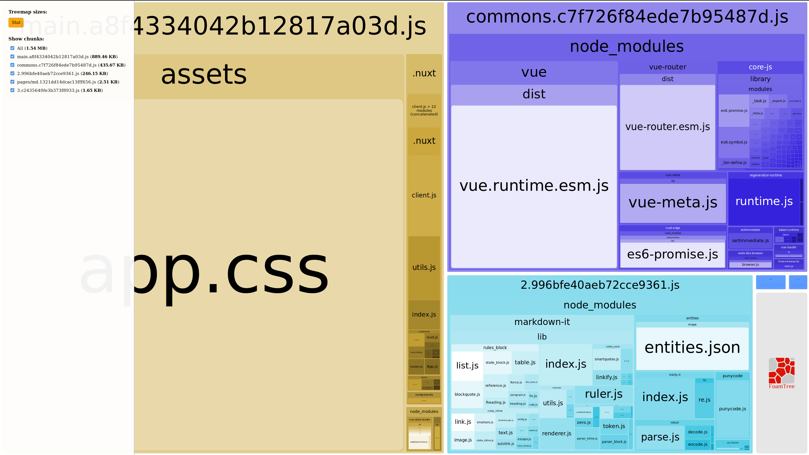

# Nuxt Edge Analyze issue

> A reproduction repo for a nuxt edge analyze bug

See here

## Installation

1. Clone the repo
2. Install modules (`npm i`)
3. Run an analyze build (`npm run build -- -a`)
4. See that app.css is incuded and only that `stat` view is available

There must be a silent error while building. When I remove the import of `markdown-it`,
everything works smooth again. On the other hand, the page (`/md`) is working as intended
as well...
